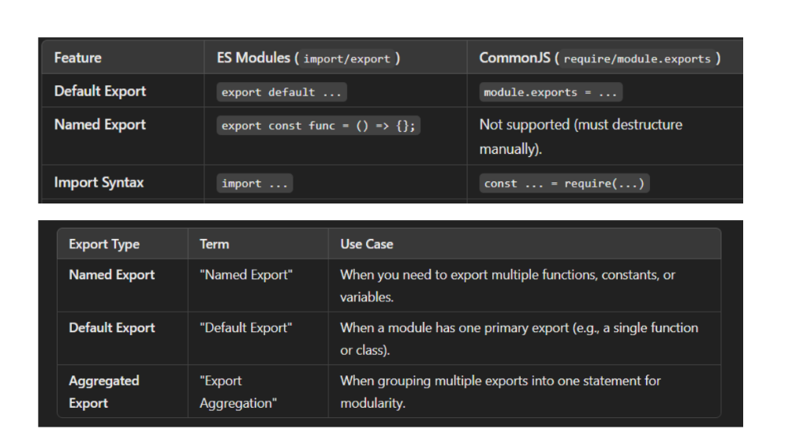

## ES Module

1. ES Modules(ECMAScript Modules) allow you to use import and export syntax.
   They have been available in Node.js since version 12.

2. To Enable ES Modules, you can either:
   a. Name your file with ".mjs" extension, or
   b. Set "type":"module" in your package.json.(Recommended)

3. Use import and Export instead of require and module.exports.

4. After Node.js v14.8, yu can use "Top-level await" when ES Modules are enabled.

5. ES Module is a part of ECMAScript and a more modern approach.

6. Even if a package uses CommonJS, we can import it into ES Modules, However importing ES modules package into CommonJS may cause issues as some packages have switched exclusively to ES Modules.

#### Note

add "type": "module" , instead of "type": "commonjs" in package.json
